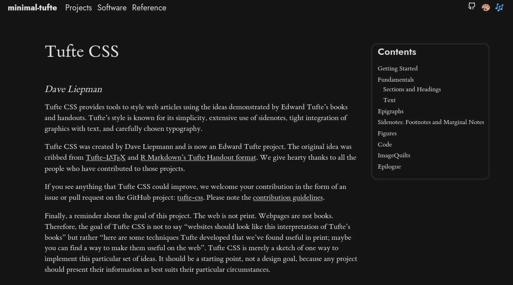
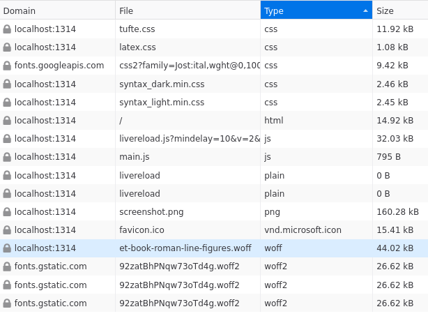

# minimal-tufte

Hugo theme with [tufte-css](https://github.com/edwardtufte/tufte-css.git).



Load sizes ( font is too large ):


## Features

Mininal features to support rendering in style of tufte.

- Responsive navbar
- Table of contents, collapsible right top
- Nested structures, list pages have links to children by default.
- Shortcodes
  - subtitle
  - newthought
  - sidenote, sidenote-label
  - marginnote, marginnote-label
  - latex, latex-sub, latex-sup
  - figure
  - iframe
  - footer

## Installation

If from start,

```bash
hugo new site my-site
cd my-site
```

Add theme.

```bash
# Use submodules
git submodule add https://github.com/manyids2/minimal-tufte themes/minimal-tufte

# Or clone and remove git to fully customize if submodules are tedious
# git clone https://github.com/manyids2/minimal-tufte themes/minimal-tufte
# rm -rf themes/minimal-tufte/.git

# Set theme in hugo
echo "theme = 'minimal-tufte'" >> hugo.toml

# Ignore theme
echo "themes/minimal-tufte" >> .gitignore

# Yaml headers
echo "---
title: '{{ replace .File.ContentBaseName "-" " " | title }}'
date: {{ .Date }}
draft: true
---
" > archetypes/default.md

# Remove demo content from themes
rm -r themes/minimal-tufte/content/*

# Create various subfolders ( default: projects, software, reference )
hugo new content projects/_index.md
hugo new content software/_index.md
hugo new content reference/_index.md

# Set the corresponding options in hugo.toml
# $EDITOR hugo.toml # Manually edit

# Populate and then edit ( lower the weight, lefter it is )

# Main -> links on left
echo "[[menus.main]]
name = 'Projects'
url = '/projects'
weight = 10
">>hugo.toml

# Social -> links on right with pre
echo "[[menus.social]]
name = "Music"
pre = '🎶'
url = "https://manyids2.bandcamp.com/track/high-tide"
weight = 30
">>hugo.toml

# Serve and check
hugo server -D
```

## Configuration

Explanation of various parts of `hugo.toml`

Base config, appears in navbar

```toml
baseURL = 'http://localhost:1314'
languageCode = 'en-us'
title = 'minimal-tufte'
theme = 'minimal-tufte'
```

Left side - links to main subfolders, order by weight.

```toml
[[menus.main]]
name = 'Reference'
url = '/reference'
weight = 10

[[menus.main]]
name = 'Projects'
url = '/projects'
weight = 20

[[menus.main]]
name = 'Software'
url = '/software'
weight = 30
```

Right side - links to socials, renders pre, order by weight.

```toml
[[menus.social]]
name = "GitHub"
pre = '<svg xmlns="http://www.w3.org/2000/svg" class="icon icon-tabler icon-tabler-brand-github" width="24" height="24" viewBox="0 0 24 24" stroke-width="2" stroke="currentColor" fill="none" stroke-linecap="round" stroke-linejoin="round"><path stroke="none" d="M0 0h24v24H0z" fill="none"></path><path d="M9 19c-4.3 1.4 -4.3 -2.5 -6 -3m12 5v-3.5c0 -1 .1 -1.4 -.5 -2c2.8 -.3 5.5 -1.4 5.5 -6a4.6 4.6 0 0 0 -1.3 -3.2a4.2 4.2 0 0 0 -.1 -3.2s-1.1 -.3 -3.5 1.3a12.3 12.3 0 0 0 -6.2 0c-2.4 -1.6 -3.5 -1.3 -3.5 -1.3a4.2 4.2 0 0 0 -.1 3.2a4.6 4.6 0 0 0 -1.3 3.2c0 4.6 2.7 5.7 5.5 6c-.6 .6 -.6 1.2 -.5 2v3.5"></path></svg>'
url = "https://github.com/manyids2"
weight = 10

[[menus.social]]
name = "Instagram"
pre = '🎨'
url = "https://www.instagram.com/fthorde2/?hl=en"
weight = 20

[[menus.social]]
name = "Music"
pre = '🎶'
url = "https://manyids2.bandcamp.com/track/high-tide"
weight = 30
```

Boilerplate.

```toml
[module]
[module.hugoVersion]
extended = false
min = "0.116.0"
```

Necessary for nesting of shortcodes, html freely.

```toml
[markup.goldmark.renderer]
unsafe = true
```

Config for table of contents in single page.

```toml
[markup]
  [markup.tableOfContents]
    endLevel = 3
    ordered = false
    startLevel = 2
```

Config for code highlighting.

```toml
  [markup.highlight]
    anchorLineNos = false
    codeFences = true
    guessSyntax = false
    lineAnchors = ''
    lineNoStart = 1
    lineNos = false
    lineNumbersInTable = true
    noClasses = false
    noHl = false
    style = 'monokai'
    tabWidth = 4
```

Config for site search (NOT IMPLEMENTED YET).

```toml
[outputs]
  home = ["HTML", "RSS", "JSON"]
```

## Sources

1. [Dark mode javascript](https://ultimatecourses.com/blog/detecting-dark-mode-in-javascript)
2. [Adaptive highlight for hugo](https://data-dive.com/adaptive-syntax-highlighting-for-hugo-blog-dark-mode/)
