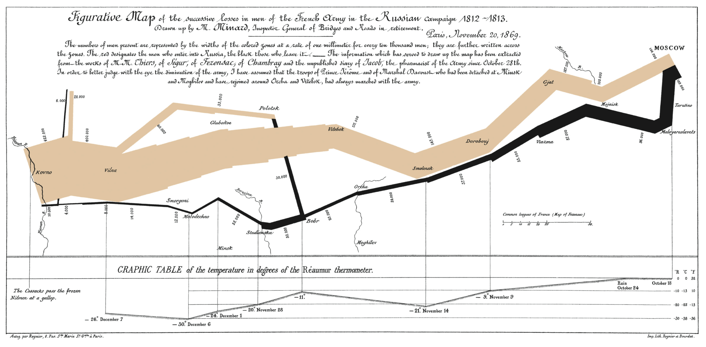

<section>

<hr>

## subtitle

Code:

```


// <p class="subtitle">{{ .Get 0 }}</p>
```

Example:

<div class="example">
  <p class="subtitle">Subtitle</p>
</div>

Parameters:

| key   | value                   | doc                |
| :---- | :---------------------- | :----------------- |
| align | left \| right \| center | align the subtitle |

<hr>

</section>
<section>

## newthought

Code:

```
As I was saying,
this is a newthought.

// <span class="newthought">{{ .Inner | markdownify }}</span>
```

Example:

<div class="example">
  <span class="newthought">As I was saying,</span> this is a newthought.
</div>

Parameters:

| key  | value                     | doc                |
| :--- | :------------------------ | :----------------- |
| font | jost \| et-book (default) | Font of newthought |

<hr>

</section>
<section>

## sidenote, sidenode-label

Code:

```
In his later notes,
// <label for="sn-{{ .Get 0 }}" class="margin-toggle sidenote-number"></label>

 [*Beautiful Evidence*](...) 
// <input type="checkbox" id="sn-{{ .Get 0 }}" class="margin-toggle">
// <span class="sidenote">{{ .Inner | markdownify }}</span>
```

Example:

<div class="example">
In his later notes<label for="sn-in-his-later" class="margin-toggle sidenote-number"></label>,
<input type="checkbox" id="sn-in-his-later" class="margin-toggle">
<span class="sidenote"><a href="..."><em>Beautiful Evidence</em></a></span>
</div>

Parameters:

| key   | value          | doc                             |
| :---- | :------------- | :------------------------------ |
| label | id of sidenote | necessary to align the sidenote |

<hr>

</section>
<section>

## marginnote, marginnote-label

Code:

```
This is the anchor.
// <label for="mn-{{ .Get 0 }}" class="margin-toggle"></label>

 This is the note 
// <input type="checkbox" id="mn-{{ .Get 0 }}" class="margin-toggle">
// <span class="marginnote">{{ .Inner | markdownify }}</span>
```

Example:

<div class="example">
  This is the anchor<label for="mn-in-his-later" class="margin-toggle"></label>.
  <input type="checkbox" id="mn-in-his-later" class="margin-toggle">
  <span class="marginnote">This is the note</span>
</div>

Parameters:

| key   | value          | doc                             |
| :---- | :------------- | :------------------------------ |
| label | id of sidenote | necessary to align the sidenote |

<hr>

</section>
<section>

## figure

### default

Code:

```

From Edward Tufte, <em>Visual Display of Quantitative Information</em>, page 92.


// <figure class="">
//   <label for="mn-exports" class="margin-toggle">⊕</label><input type="checkbox" id="mn-exports" class="margin-toggle">
//   <span class="marginnote">
// From Edward Tufte, <em>Visual Display of
// Quantitative Information</em>, page 92.
//   </span>
//   
// </figure>

```

<figure class="">
  <label for="mn-exports" class="margin-toggle">⊕</label><input type="checkbox" id="mn-exports" class="margin-toggle">
  <span class="marginnote"> From Edward Tufte, <em>Visual Display of Quantitative Information</em>, page 92. </span>
  
</figure>

### fullwidth

```



// <figure class="fullwidth">
//   <label for="mn-napoleons-march" class="margin-toggle">⊕</label><input type="checkbox" id="mn-napoleons-march" class="margin-toggle">
//   <span class="marginnote"> </span>
//   
// </figure>
```

Example:

<figure class="fullwidth">
  <label for="mn-napoleons-march" class="margin-toggle">⊕</label><input type="checkbox" id="mn-napoleons-march" class="margin-toggle">
  <span class="marginnote"> </span>
  
</figure>

Parameters:

| key   | value             | doc   |
| :---- | :---------------- | :---- |
| class | "" \| "fullwidth" | width |

<hr>

</section>
<section>

## latex, latex-sub, latex-sup

Code:

Uses `{{- "" -}}` to terminate without newline.

```
 LaTeX 

// <span class="latex">{{ .Inner | markdownify }}</span>{{- "" -}}
// <span class="latex-sup">{{ .Get 0 }}</span>{{- "" -}}
// <span class="latex-sub">{{ .Get 0 }}</span>{{- "" -}}
```

Example:

<div class="example"><p>
<span class="latex">L<span class="latex-sup">a</span>T<span class="latex-sub">e</span>X</span>
</p></div>

<hr>

</section>
<section>

## iframe

Code:

```


// <p class="subtitle">{{ .Get 0 }}</p>
```

Example:

<div class="example">
  <p class="subtitle">Subtitle</p>
</div>

Parameters:

| key   | value                   | doc                |
| :---- | :---------------------- | :----------------- |
| align | left \| right \| center | align the subtitle |

<hr>

</section>
<section>

## footer

Code:

```
footer

// <footer>footer</footer>
```

Example:

<div class="example">
<footer>footer</footer>
</div>

<hr>

</section>
